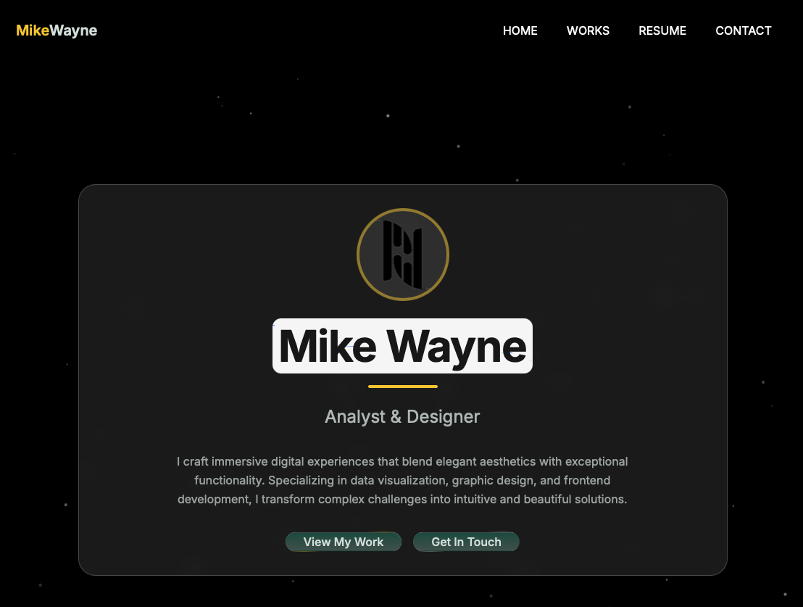

# Mike Wayne Portfolio

A modern, interactive portfolio website showcasing Mike Wayne's skills, experience, and projects as an Analyst & Designer.



## Features

- **Interactive UI**: Modern design with responsive glass-morphism elements
- **Skills Showcase**: Interactive physics-based skills section with gravity toggle
- **Project Galleries**: Dedicated sections for analysis and graphic design work
- **Responsive Design**: Fully mobile-optimized experience across all devices
- **Animated Elements**: Smooth transitions and animations throughout
- **Interactive Physics**: Matter.js physics engine for interactive skill tags

## Live Demo

Visit the live portfolio at: [https://mikewayne.com](https://mikewayne.com)

## Technologies Used

This portfolio is built with modern web technologies:

- **React**: Frontend framework for component-based UI
- **TypeScript**: For type-safe code and better developer experience
- **Vite**: Fast, modern frontend build tool
- **Tailwind CSS**: Utility-first CSS framework for styling
- **Matter.js**: 2D physics engine for the interactive skills section
- **Framer Motion**: For smooth animations and transitions
- **React Router**: For client-side routing between pages

## Mobile Optimization

The portfolio is fully optimized for mobile devices with:

- **Responsive Layout**: Adapts to any screen size from mobile to desktop
- **Touch-Friendly**: All interactive elements work well with touch input
- **Performance Optimized**: Fast loading and smooth animations on mobile
- **Accessible Design**: Follows accessibility best practices
- **Mobile-First Approach**: Designed with mobile users in mind

## Getting Started

### Prerequisites

- Node.js (v14.0 or higher)
- npm or yarn

### Installation

```bash
# Clone the repository
git clone https://github.com/yourusername/mikewayne-portfolio.git

# Navigate to the project directory
cd mikewayne-portfolio

# Install dependencies
npm install

# Start the development server
npm run dev
```

## Project Structure

```
mikewayne-portfolio/
├── public/               # Static assets
├── src/
│   ├── components/       # Reusable UI components
│   ├── lib/              # Utility functions
│   ├── pages/            # Page components
│   └── hooks/            # Custom React hooks
├── package.json          # Project dependencies and scripts
└── README.md             # Project documentation
```

## Usage

### Updating Content

- **Resume Data**: Edit the `ResumeSection.tsx` file to update experience and education
- **Projects**: Modify the projects array in `WorksSection.tsx` to add or edit projects
- **Skills**: Update the skillCategories array in `ResumeSection.tsx` to change skills

### Adding Images

1. Place new images in the `public` directory
2. Reference them in components with paths like `/your-image.jpg`

## Interactive Skills Section

The portfolio features a unique physics-based skills section that allows users to:

- Toggle gravity on/off with the "Gravity" button
- Drag and interact with skill tags when gravity is disabled
- Watch skills respond to realistic physics

## License

This project is available as open source under the terms of the MIT License.

## Contact

Mike Wayne - [contact@mikewayne.com](mailto:contact@mikewayne.com)

---

Portfolio designed and developed by Mike Wayne - 2024
